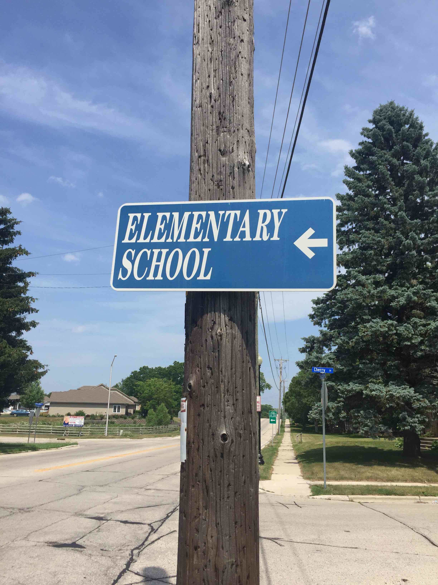
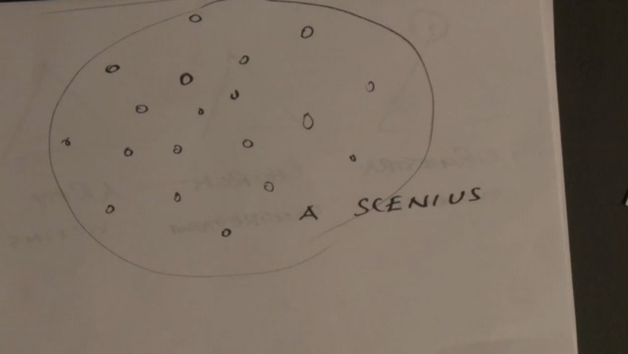

## curriculum for my high school self

### Learning objective 
Students will learn to ask big questions without needing answers in a collection of classes, over one year. 

### Curriculum
Through structured collaboration and active discussions, students will learn to listen closely to each other, speak from their own experience and embrace differences as positive points of connection. Students will not be rewarded for having the right answer. Instead they will be encouraged to ask questions of everything they are learning with the intention of learning more. They will be encouraged to challenge their teachers and their peers with the intention of learning from each other and together.

Students will approach science through physical interaction with the earth. They will go on walks throughout the overly paved suburbs. They will go on hikes in the woods. They will find nature in the city. They will come to understand the earth and all of its inhabitants and systems as directly affecting one another. Through a deep understanding of the earth's physicality and the systems that affect it students will develop personal relationships to the earth and come up with rituals that ensure their care of it. 

Students will approach math through knitting, music, and computers. They will rely heavily on making, listening to sound, and computational metaphor to understand mathematical concepts (which I can't even name because no one taught them to me in a way that was inspiring enough for me to remember).

In an effort to dismantle misperceptions around gender and gender roles all examples in all fields of study will pay equal if not more attention to the women who have pioneered in those fields.

Students will approach history through a critical understanding of it. They will come face to face with colonialism, ugly histories of the world, and specifically with the United State of America and its problematic place in the world. They will do this primarily through close reading of mostly non-text book histories and deep discussion.

Students will approach health through caring for each other. They will learn to cook for each other and how to provide emotional support when needed through listening. They will learn to be open with their feelings while also valuing another person's right to keep to themselves. They will learn how to create safe spaces for one another so that they can speak freely and with intention. They will learn how to give each other space and how to respect each other's needs as constantly growing, changing and confused teenagers. Most importantly they will learn to deeply values relationships that are platonic and that developing emotional intelligence is a sign of strength not weakness.

### Learning outcome
Students will achieve an understanding of the systems that make up the world around them and how to be an active participant in positive change throughout the classes.
