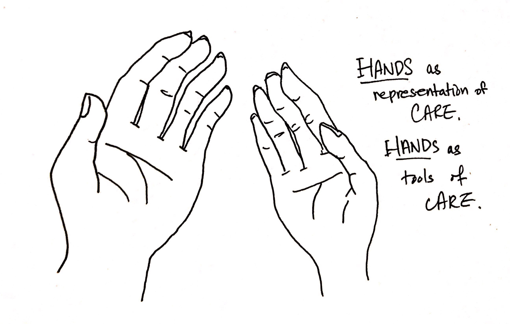

# Care at Scale

This class examines care at different scales: care for oneself, for each other and for the community. Through the subject of care, students have the opportunity to re-examine and deeply explore oneself, those around them and the communities that they are part of. Students will progress from reflecting internally about what care means to them and what the care about, then to being considerate of what others care about and how to express care for them, and finally explore how care is expressed in the community level. 

This class is a self-led research and production based class, during which students will produce reflective writings, small scale hands-on projects using skills that they will learn through workshops and conduct research on topics that they care about to present to the rest of the class. 

This class is about care. Thus is is important that students care not only about themselves, but also *care about others in the class*. During class, students need to pay attention to their own internal thoughts and emotions, but also be respectful of that of others as well. In this respect, students will not be permitted to use their mobile devices and laptops, as all in-class activities that are scheduled for this class will not require them to use them.

## Learning Objectives
In this class, students will learn:
* learn what it means to care.
* how to reflect their thoughts through form of writing and crafting.
* how to practice and express care about each other.
* to place themselves in different scopes and to think about what it means to be part of different scales of communities.

## Learning Outcomes
In this class, students will achieve:
* growth through learning and caring more about themselves as well as others around them.
* the feeling of fullfillment of expressing their care for people, objects, communities.

## Schedule

### Week 1: Care for Oneself
This week, we will focus on care for yourself. We will concentrate on reflecting on how we care and didn't care about multiple facets of your daily life. We will learn to express these thoughts on paper, but this week, all of your writings will be private to yourself and we won't be presenting them in public during class. Use this opportunity as a space just for yourself and concentrate on studying who you are and what you care about.

* In Class Activities:
  * Think about an instance that you didn’t care enough. Spend about 5 minutes in silence without writing all of your thoughts down. Then spend 10 minutes reflecting on the incident and about how you could have cared more.
  * Think about all the things that you care about. Spend about 5 minutes in silence without writing all of your thoughts down. Then make a list of all those things. Can you group them into categories? Can you make a more general list of through grouping them?
  * Write a short poem about care, based on your reflections about what your care and didn't care about.
* Assignment:
  * Keep a diary for this week about what we *care* about. It could be about friends, about oneself or about your studies. Focus writing about the one subject of care for one week and see how your thoughts progress.
  
### Week 2: Care for Each Other
This week, we will learn how to care about another person and express their care for them through means of embroidery. We will have the chance to reflect through the act of manual work and learn to think about what it means to spend time and effort thinking and express care for another person. 

* In Class Activities:
  * Present your reflections about your experience of keeping a diary for the week. Talk about how you felt when you were writing it, and whether you think it help or didn't help you.
  * Expressing Care through Embroidery
    * Workshop - The basics of embroidery: Creating patterns with [different stitches](https://www.thesprucecrafts.com/stitches-every-embroiderer-should-know-4122123)
    * Think about someone that you care about and create an embroidery work for that person. Through patterns, think about how you can express your care for them.
* Assignment:
  * Finish your embroidery work and be ready to present your work in next class and to talk how your work expresses care for the person you have chosen to create it for.
  
### Week 3: Care for Each Other
This week, we will examine what it means to care about something together as a group. We will also examine the experience of having an object of mutual care through the means of planting.

* In Class Activities: 
  * Workshop - Care through Planting
    * In groups of two, we will go out to the school garden and plant something of your choice. You will be taking care of this plant together during the rest of this class (and for longer, if you choose to do so). Give your plant a name. Think about what you think this plant will need for the upcoming weeks. How will you take care of your plant?
  * Mutual Care Project: In the same planting group, you will need to create something for what you both care about in common - a Mutual Care Project. Take interest in what the other cares about. The thing you make could be abstract or physical. It could be a plan for an event or a product. It could be a physical thing that you create that could be used to express your mutual care. Start brainstorm your ideas.
* Assignment:
  * Finish your Mutual Care Project and be ready to present about it in class next week.
  
### Week 4: Care for Each Other
This week, we will be presenting on our Mutual Care Project. We will be taking a conscious effort to care about the fellow classmates that are presenting and think about what it means to express care through respect and attention.

* In Class Activities:
  * Care through Planting reflections: Talk about what your week has been to take care of your plant with your partner. What went smoothly? What didn't go smoothly, and why?
  * Present your Mutual Care Projects. While others are presenting, take notes about whether you felt the care that they felt about the subject of choice of the project. Express your care for your fellow classmates by paying active attention.
* Assignment:
  * Write a poem about your planting experience with your partner. Try to reflect on your emotions and thoughts that you've had while taking mutual care about your plant.
  
### Week 5: Care for the Community
This week, we will bring our care to the community level. We will examine what communities that we are part of and talk about why we care about them. We will also look at instances of what other people have expressed their care about their community.

* In Class Activities:
  * Make a list of communities that you think you are part of. Think in all scales. Why do you think you are part of those communities? Are you a member of the community by choice? Do you care about the communities that you are part of, if so why?
  * Reading - [Art is Medicine](https://www.artforum.com/print/201803/helen-molesworth-on-the-work-of-simone-leigh-74304): We will read about Simone Leigh's work together in class and talk about her care for Leigh's community.
* Assignment:
  * Research about an instance that an individual or an organization acted on their care for their communities. Be ready to present in class next week.

### Week 6: Care for the Community
This week we will take the opportunity to think about the ways that we can express our care for communities. We will also take a moment to reflect upon what we were able to learn about ourselves during the course of 6 weeks and talk about whether anything has changed since the beginning of class.

* In Class Activities:
  * Present your research on an individual or an organization's care for their community.
  * Research about organizations in the city that are actively working in the communities that you care about. Are there organizations that you are interested in taking a part of? What are some of their work that you think is the most interesting?
  * Create a list of things that you care about. Compare the list with the one you made in week 1. Have things changed? Do you care about new things? What made you care about them?  
