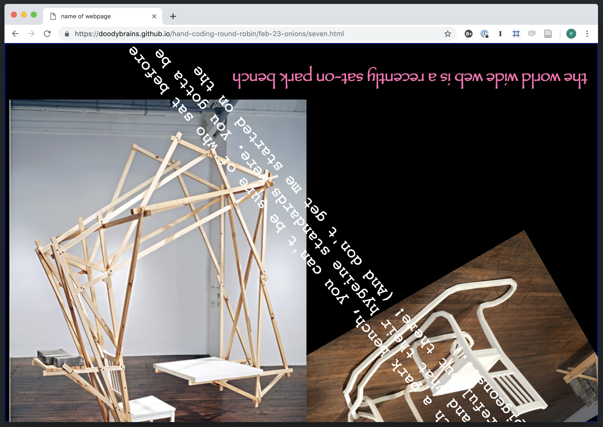
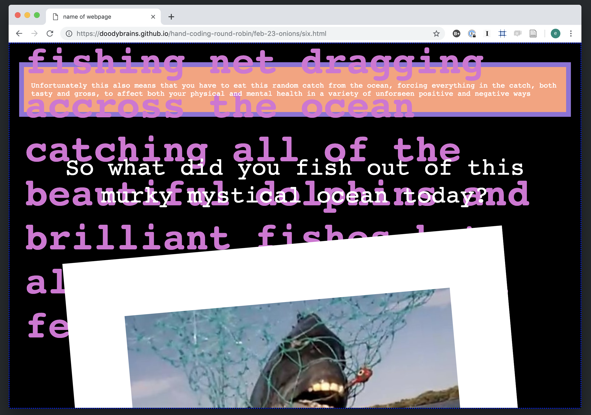

# hand coding round robin

hand coding round robin is a one hour workshop where a group of students will learn how to hand code a web page. they will learn how to do this kind of coding slowly and with care. equal attention will be given to HTML elements, CSS styles, and the actual content on the page. through the adding and styling each others web pages students will learn the basic building blocks of web development as well as what it feels like to code with and for each other.

[syllabus here](https://github.com/doodybrains/hand-coding-round-robin)

[workshop slides here](https://doodybrains.github.io/hand-coding-round-robin/)

the world wide web is full of applications with shiny animations, complex databases, and robust frameworks. i think this leads to the misconception that web development is difficult. of course programming has potential to be an arduous practice but i think we have lost sight of some of the simpler tools that brought us web development in the first place.

i have been thinking a lot about the origins of computation. this workshop will be a reflection of those thoughts in that we will be moving slowly, typing out each character one by one, and taking note of what is in front of us before we begin to code. it will be an effort to demystify web pages and also bring students closer to the relationship between HTML pages and browsers.

the target audience for this workshop will be adults who are interested in learning the fundamentals of web development. all skill levels will be welcome although participants will probably find it helpful to have familiarity with working with code in an editor.

programming is really just a set of abstractions in which the programmer is telling a software to tell the hardware of their computer to turn a bunch of switches on or off. because of this, i believe that programmers have a false sense of control and ownership over the things that they code. i think it's important to erode this notion of power first by working on each other's computers and second by not relying on any kind of build process or external libraries for making the code do a certain thing. we will code only with most basic tools needed for a browser to display the contents of a web page.

hand coding round robin is bringing it way back. by the end of the workshop, each participant will have a single HTML file to take home and build off of. what would it mean for each person in the whole world who had an internet connection to have their very own hand coded website? maybe we would feel a different kind of closeness to people online.

#### timeline:

2/22/19 - practice workshop with friends

2/23/19 - collect feedback from taa class

2/24/19 - integrate feedback into slides and syllabus

2/25/19 - create Eventbrite and send out, social media

2/26/19 - create a file sharing system/drive for collecting files

2/27/19 - finalize syllabus / slides

2/28/19 - finalize syllabus / slides

3/1/19 - send out an email to workshop participants

3/2/19 - workshop day

#### materials + budget:

- projector/screen for presenting from my computer

- each student will need to bring their own computer

- $10 for cookies :)
