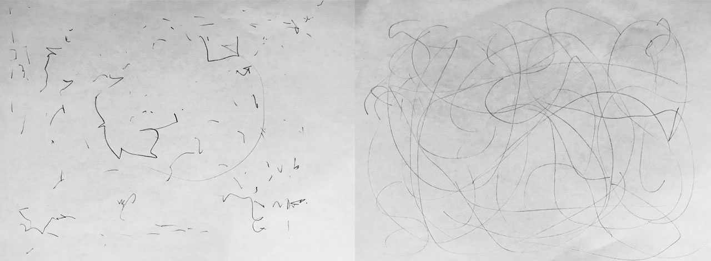
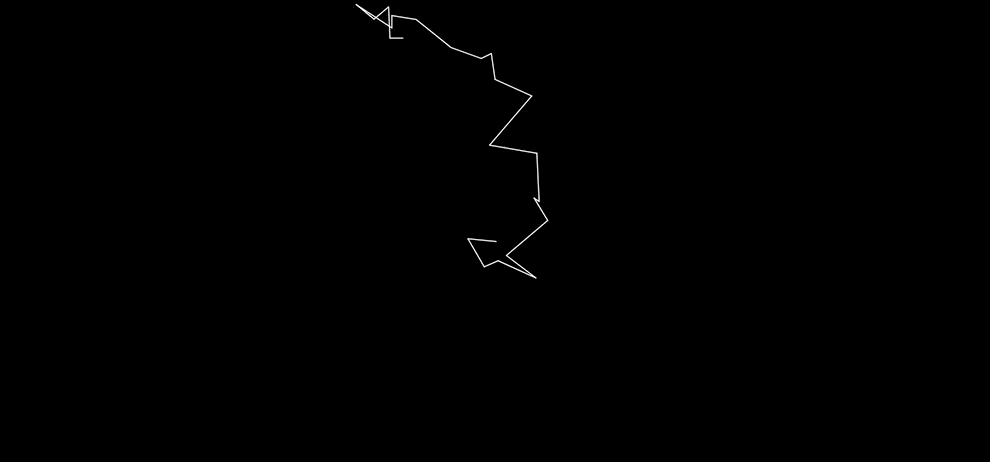
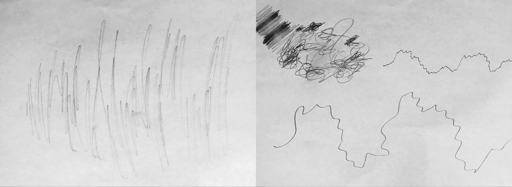
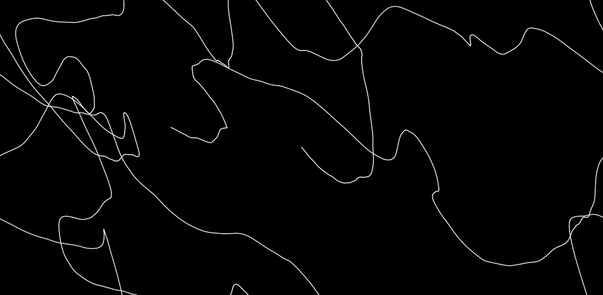
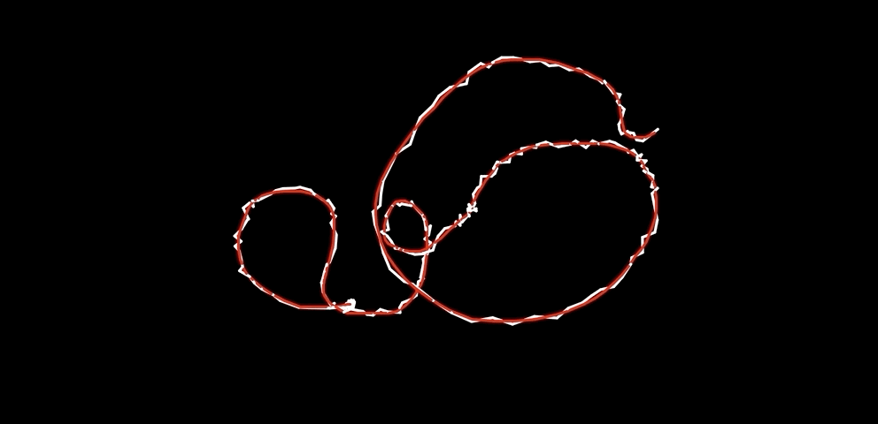
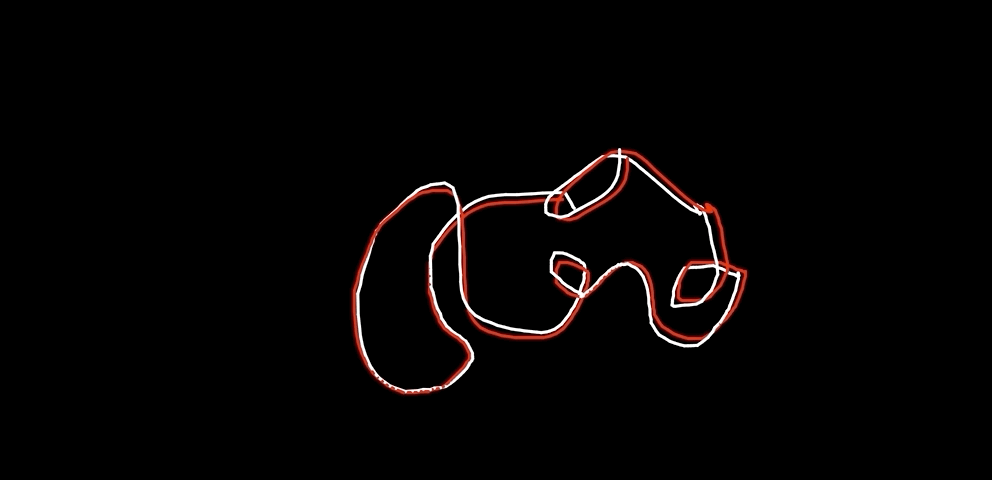
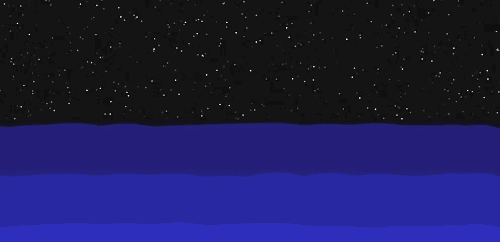
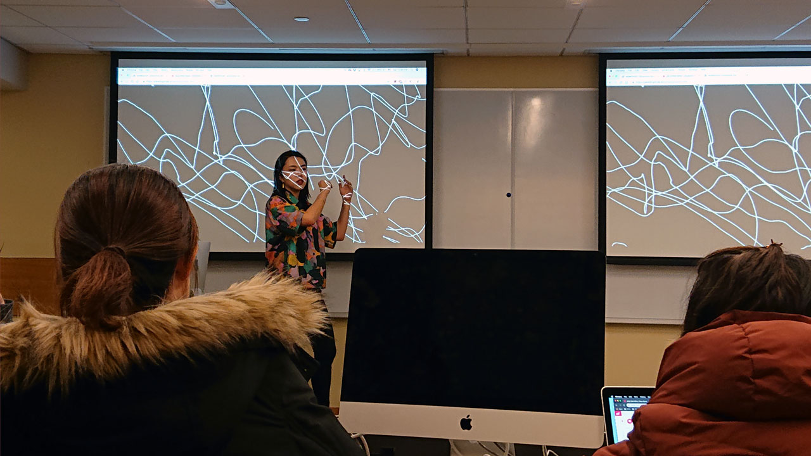
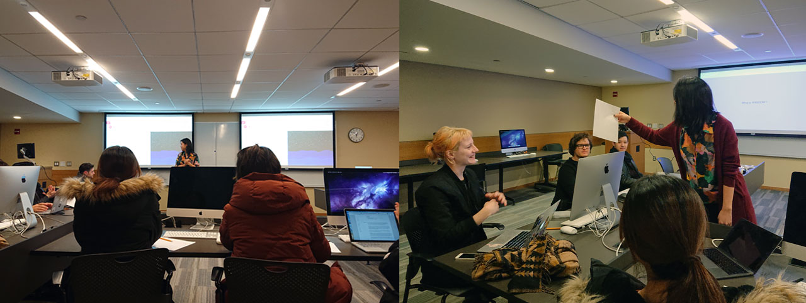

# Generative Random Art

In this workshop, we ask the fundamental question of what randomness is and what it looks like. By asking students to express what they think random is, and by looking at what can constitute as randomness in nature, the workshop attempts at defining random. We ask the question of whether complete randomness is useful in creating visuals and explore ways to tame the randomness to create a desired controlled randomized visuals in [p5.js](https://p5js.org/), a javascript library for creating visuals.

Students will approach the concept of random first with pen and paper, to reflect on what their idea of random is. Then they will examine whether their idea of random is truly random and compare it with p5's idea of randomness. We will also compare two functions that can be used to generate random values in p5.js: random() and noise(). We will attempt at gaining a deeper knowledge of these functions by applying different visuals using these functions and go further into controlling it with other functions such as modulus(%) and map().

This workshop is presented as a final project for [Teaching as Art](https://teachingasart.github.io/posts/teachingasartday/)class at NYU ITP.

## Structure of the Workshop
The written material for this workshop is also available on [this webpage](https://js6450.github.io/random/), and the presentation used is available on [this webpage](https://js6450.github.io/random/present.html).

### What is Random? (15 Min)
Draw what you think random looks like on a piece of paper. Then discuss whether the drawing is truly random or not. (Examples of student drawings at the workshop below.)

Watch sections of videos that explain concepts of random in [every day context](https://www.youtube.com/embed/9rIy0xY99a0) and in [context of computer science](https://www.youtube.com/embed/GtOt7EBNEwQ), and continue discussion about random in context of computer science & programming.

First start off simple. Here is what you get if you use a random number to generate the x position of the ellipse. Discuss how this movement feels. ([link to code](https://editor.p5js.org/js6450/sketches/bXJ7Gr9jq))

What are the properties of this graph? What's the width and height of this graph? What is the mid horizontal point of this graph? What is the maximum value and the minimum value? ([link to code](https://editor.p5js.org/js6450/embed/sNZEDmYuN))

#### Coding with random()
As explained in the videos above, this what the random walk looks like, which draws continuous lines of randomly generated x and y coordinates. Let's create this random walk using p5.js ([link to code](https://editor.p5js.org/js6450/sketches/pd0lXqU_V)).

### What is Noise? (15 Min)
Draw what you think noise looks like. Talk about how this drawing is different, or same, as the random drawings done previously. (Examples of student drawings at the workshop below.)

We will start simple with this one too. Here is what the horizontal movement of an ellipse looks like using noise() function. How does this movement make you feel compared to the random movement we saw previously? ([link to code](https://editor.p5js.org/js6450/embed/z5Dbv9tO5))

What are the properties of this graph? What's the width and height of this graph? What is the mid horizontal point of this graph? What is the maximum value and the minimum value? ([link to code](https://editor.p5js.org/js6450/embed/mVEA_QnM1))

#### Coding with noise()
Let's create this an adaptation of the random walk that we saw using the noise() function in p5.js ([link to code](https://editor.p5js.org/js6450/sketches/aeykVYLr4)). What are the differences? What are the similarities? 

### Optional: Random vs Noise
Now lets look at how we can create different emotions to generate lines and shapes using random() and noise().

Below are two simple drawing tools, using random() and noise(). The red line represents the real mouse positions, and the white line represents the lines drawn with random() or noise() values added to the real mouse position values. (Random: [link to code](https://editor.p5js.org/js6450/sketches/odzvPMSWh), Noise: [link to code](https://editor.p5js.org/js6450/sketches/zokbnRFbM))

This is how we could animate a circular edged shape, to create a blob like movement, using random() and noise(). (Random: [link to code](https://editor.p5js.org/js6450/sketches/OHHeLDUo7), Noise: [link to code](https://editor.p5js.org/js6450/sketches/UICJ8O9ul))

### Combining Random and Noise (20 Min)
Using the different characteristics of random() and noise(), this is an example of how the two different functions could be used to create a complete generated scene. The random() function is used to generate star-like visuals for the upper half of the sketch, and we use noise() function for smoothly fluctuating the curved lines for the waves. ([link to code](https://editor.p5js.org/js6450/sketches/922I-uQ4P))

### References
* [Choreographic Interventions](https://github.com/mimiyin/choreographic-interventions-s19/), Mimi Yin
* Chapter 3: The Wrong Way to Draw A Line, [Generative Art](https://www.manning.com/books/generative-art), Matt Pearson.
* [Random Walks](https://natureofcode.com/book/introduction/), Nature Of Code, Daniel Shiffman
* [The random() Function](https://www.youtube.com/watch?v=nfmV2kuQKwA), Coding Train, Daniel Shiffman
* [Perlin Noise](https://www.youtube.com/watch?v=Qf4dIN99e2w), Coding Train, Daniel Shiffman

## Learning Objectives
In this workshop, students will learn:
* to question the basics of a concept to be able to gain a deeper understanding and achieve higher level of control.
* to use random() and noise() functions in p5.js with greater degree of control and intention.
* to create visuals in p5.js using random() and noise() functions.
* to be able to distinguish when to use random() and when to use noise() function.

## Learning Outcome
In this workshop, students will achieve:
* a deeper understanding of the concepts of random and noise.
* the ability to question whether something truly is "random" and "noisy".
* the ability to apply their understanding of random and noise to seeing patterns in nature.
* the ability to apply their understanding of random and noise in creating visuals.

## Timeline for Preparation
* D-7 & D-6: Create code examples and write online tutorial for workshop.
* D-5: Create registration page and start promotion.
* D-3: Run practice workshop with a small group of people and receive feedback.
* D-2: Adjust workshop content according to feedback from practice workshop.
* D-1: Send reminder emails to people registered for the workshop.
* D-Day: Workshop day

## Materials and Budget: 
The workshop has approximately $10 dollars of material cost, and below is the list of materials required and their associated cost:
* Students must bring their own laptops to class.
* Paper (Will use scrap paper - 0$)
* Pencils (approx. $10)

## Documentation of Workshop (March 2, 2019)

### Student Feedback
To collect student feedback, I created a Google Form to ask the following questions:
* After this workshop, what do you think random is?
* How was the pace of the workshop? (Options: Fast, Moderate, Slow, Other)
* How was the level of difficulty? (Options: Hard, Okay, Easy, Other)
* How engaging was the content? (Options: Very, Okay, Not really, Other)
* What was the most memorable moment of the workshop?
* What was something that you wished to have seen / learned at the workshop?
* Any other feedback?

Out of the 15 people that attended the workshop, 8 of them responded. The summary of their responses are below:
#### After this workshop, what do you think random is?
All responses were very intersting. 7 out of the 8 people who gave feedback wrote their answer for this question. Some commented on the existence of pattern in what we thought were random, and some questioned their use of the word random. One person described random with emotive words. Below is the list of their responses:
* something not necessarily without pattern, but hard to predict what exactly it will be even though we know the general pattern of it
* Maybe there's no pure randomness in this world and all things have their patterns, some may be hidden tho. The patterns in randomness are also components of random arts.
* Definitely have a new awareness of the instances in which I used to call things "random". Before the workshop, I thought random was simply uncontrolled, but through coding, there is an element of pre-determination, and naturally patterns occur.
* Random is in the hands of the beholder.
* What are we going to eat for dinner?
* I think random is nondeterministic action. It's erratic, frantic, anxious, and unpredictable.
* Unpredictable behaviour that is really difficult to recreate accurately

#### How was the pace of the workshop? (Options: Fast, Moderate, Slow, Other)
6 people answered Moderate, 1 person answered fast, 1 person answered other - moderate but rushed at the end.

#### How was the level of difficulty? (Options: Hard, Okay, Easy, Other)
6 people answered okay, 2 people answered easy because they had existing knowledge.

#### How engaging was the content? (Options: Very, Okay, Not really, Other)
Everyone answered back with very engaging.

#### What was the most memorable moment of the workshop?
People commented on how seeing the direct contrasts between random() and noise() use cases was helpful to see their differences. There were also comments on how drawing out what they thought were random and noise were engaging and helpful to think about their concepts. 2 people commented on how they were able to think about their concepts a little deeper and more philosophical. Below is the list of the responses:

* the moment when I suddenly realized that this way of utilizing code to elaborate on such a philosophical topic can be so cool!
* When drawing out random and noise, it really pushed me to think deeper.
* So many positives! The media components and the visual examples of Random vs. Noise were extremely helpful. The drawing activities were fun, interactive, and eye-opening. The instructor was clearly prepared and incredibly engaging. They had excellent command of the room and of the content. Great facilitation!
* The opacity background trick for fading elements in a p5 sketch.
* The difference between random + noise. How noise patterns were smoother - defying expectations.
* Making very cool looking noisy walks.
* Seeing the random graph vs the noise graph visually

#### What was something that you wished to have seen / learned at the workshop?
There were two general things that people wanted to see more at the workshop: 1) more time allocated to coding and 2) other examples of computational artworks that use random and / or noise. The majority of people wanted to have had more time for the workshop in general.

#### Any other feedback?
One person gave a great comment about perhaps having half finished code for students to try to complete.

### Reflection
First of all, I thought it was a rewarding experience to be able to teach such a wide audience of people. There were some people that I knew, who were a mix of non-student, graduate students and undergraduate students, and there were people whom I didn't know at all who had signed up to attend the workshop.

Overall, I felt like the syllabus and material that I created had structure. However, I felt that for the flow and content of the workshop that I had created, it was something more for a longer duration workshop (1.5 hour would have been adaquate for the content prepared). I think this came from the fact that I am very used to creating workshops for this duration and during the mini-workhshop run through, I was able to move through the material faster because the people that I ran the practice workshop with had adequate understanding of p5.js. From the feedback that I got from the practice workshop, I had put in the video links to prompt people to discuss what they thought about random, which I thought was valuable component of the workshop, but at the same time, took more time. 

The fact that feedback also points towards the direction that more time was needed for the content also makes me feel that maybe I could have reduced down the content of the workshop all together, perhaps getting rid of the noise component, but also, since a lot of people liked seeing the contrast between random() and noise(), I am not so sure.

In terms of some feedback about the pace of the workshop, and after talking to Taeyoon after class and attending Emma's Hand Coding Round Robin workshop, printing out the example codes on paper would have been a great idea. Also, one person's feedback about preparing code that attendants can "fill the gap" would have been a great activity.
