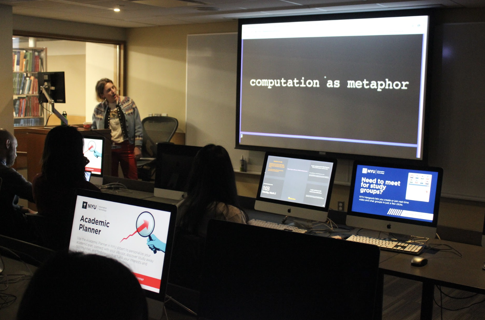
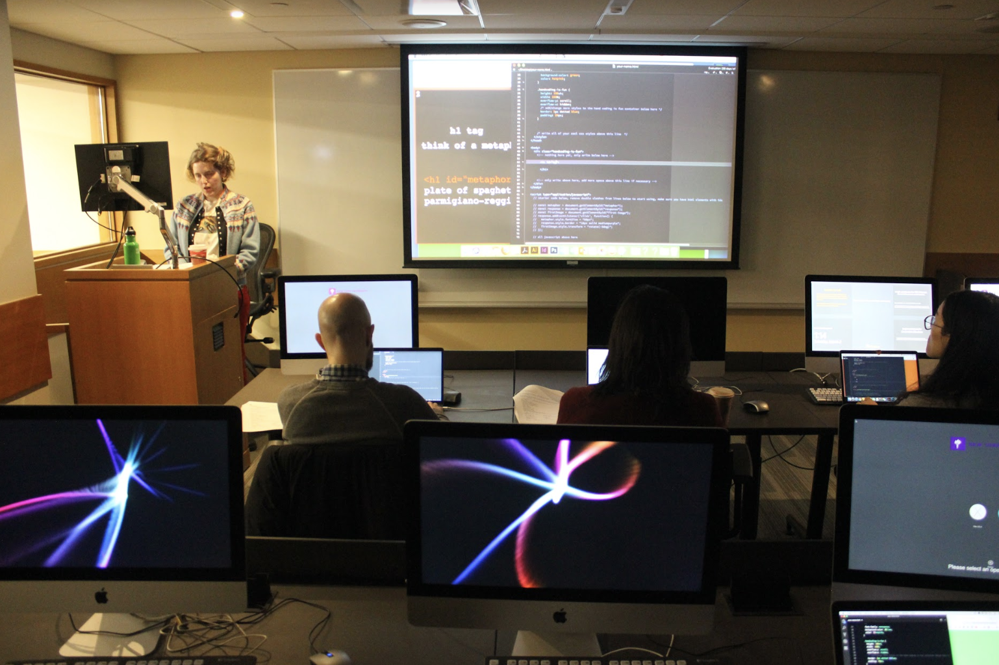
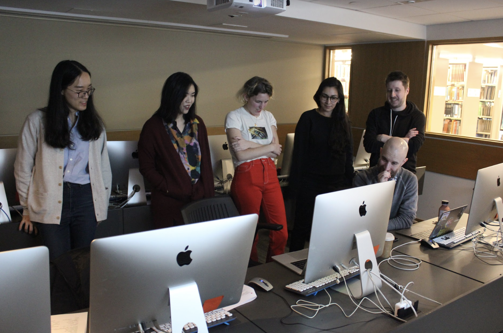
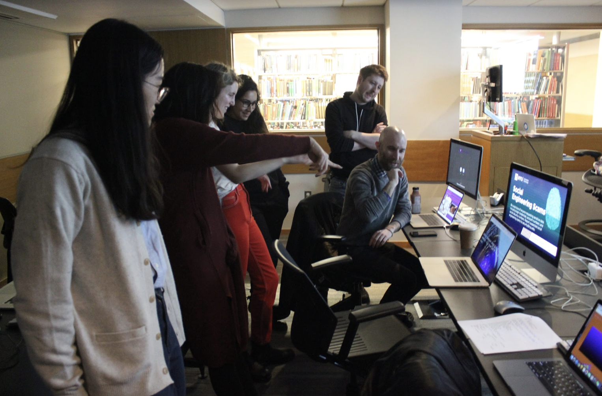

# hand coding round robin
by emma rae norton
 
 
you can also read this guide [here](https://spaghettimeatballsbecomereallyfrightening.online/teaching-as-art/week-6-workshop-reflection/).

## workshop overview

hand coding round robin is a 50 minute workshop where a group of students will learn how to hand code a web page by working on each others computers. the workshop begins with a short lecture and discussion about computation as metaphor and what it might look like to approach computation outside of the metaphors that have been given to us and through writing code with care, character by character.

the workshop should be held in a space that has a large screen or projector for the teacher. ideally the students will be able to sit in a circular formation around a table.

there is a lot of flexibility in terms of number of participants and even number of teachers. the amount of time and space available should dictate the amount of students. the session can be run smoothly in under an hour with 5-8 participants. the duration of the workshop can also be extended by facilitating a longer lecture and discussion or adding more HTML/CSS prompts, each of which should take about 2-5 minutes.

## preparation

the teacher of this workshop will need to have prepared a short lecture that starts with the idea of computation as metaphor and ends with examples of hand coded web pages. they should also be prepared to lead "code-alongs" for each prompt and answer questions about the nature of HTML, CSS, and Javascript.

the students of the this workshop will need their own computer to participate. they will be switching seats and working on each others computers so they should also be comfortable with someone else using their computer. students should also have a text editor installed on their computer and they should have downloaded the starter HTML file (provided by the teacher) before arriving at the workshop.

if following the syllabus closely, preparation should take a few hours. the most important preparation includes sending students the starter HTML file and preparing lecture notes.

## budget

so long as you have access to a projector or screen for presenting and each student has their own computer then the budget shoud be extremely small! the students find it helpful to have a print out of the coding reference which can be found [here](https://doodybrains.github.io/hand-coding-round-robin/pre-workshop-materials/hand-coding-round-robin-reader-students.docx "hand coding round robin reference for students"). cost will depend on printing service and amount of students.

 
## syllabus (in two parts)

### part I ~ lecture + discussion

*__0:00 - 0:15__*

this section will be 15 minutes. a lecture should be given at the very start of the class and questions and comments should be made throughout and after the lecture. the lecture should loosely follow the these concepts: computation as metaphor, programming as abstraction, the illusion of control that we as users of computers and programmers have over our devices and systems, dangers of the command, control, capture and reward feedback loop that programmers have with their computers, questions about the speed at which computation happens, question about what it might look like if we were to code slowly, one key at a time, and finally examples of hand coded web pages and how this type of attention to detail can be exemplary of a world wide web that is made with care for ourselves and for each other.

 
 
### part II ~ round robin

this section will be 35 minutes. each slide asks the student to move down one seat and create an HTML element. sometimes the students are asked to only style an element, sometimes they are asked to only create an element, other times they are asked to do both. the time for each element can be flexible depending on how much technical support is needed or how involved the students are in a particular prompt. the students should be back at their original seats by the last five minutes of the allotted thirty minutes.

*__0:15 - 0:20__*

Introduce H1 tag with unique ID, Introduce CSS and style by ID attribute. Students should write a metaphor for the world wide web (or computation, or reinvent the metaphor of the desktop).

*__0:20 - 0:25__*

Move down one seat, P tag inside DIV tag with unique ID, style by ID. Students should repsond to the metaphor inside the H1 tag.

*__0:25 - 0:28__*

Move down one seat, introduce IMG tag with unique ID, students should copy and paste andirect url for an image found on the web. Image should be selected in response to the P tag response.

*__0:28 - 0:32__*

Move down one seat, Style image by ID.

*__0:32 - 0:39__*

Move down one seat, freestyle section! Ask students to create an element that answers the question of the possible hidden meaning of the web page. Students who have more coding experience can feel free to uncomment the javascript at the bottom of the page.

*__0:39 - 0:42__*

Return to original seat, final P tag, style by ID. Students can write anything inside this P tag. Possible prompts might be to write a conclusion for the page or to write about how it felt to code on someone else's computer.

*__0:42 - 0:50__*

Optional sharing and post-workshop notes. Ask students to send you their files and answer any outstanding questions.
 
 

 
 
*original lecture slides can be found [here](https://doodybrains.github.io/hand-coding-round-robin/ "Hand Coding Lecture Slides").*

*original syllabus can be found [here](https://github.com/doodybrains/hand-coding-round-robin "Hand Coding Round Robin Syllabus").*

## notes on sharing

in the same round robin style the teacher and the students should stand up and briefly observe and discuss each web page. this can be done over the last 5-10 minutes depending on how many students are in the workshop and how much time is left.

## notes on wrapping up

ask the students to rename and email you their HTML files. the files should be put up onto a github or an easily accessible web page for them to view. they should also be encouraged to work off of their existing files to keep building their own hand coded pages.

## reflection + student feedback

the workshop will run best with students who have written HTML or CSS in a text editor at least once. this ensures that students are already comfortable with the relationship between writing code in an editor and having it perform in another application like the browser.

most students in the first two runs of this workshop had extremely positive feedback. they were excited about learning how to code for a web page and also excited by the results of their code. it is important to read the room for skill level so that the teacher can spend more time introducing things if needed. for example, if there are several students who aren't so familiar with CSS then it is important to move slowly with the first H1 element and teaching the students how to style it.

it might also be interesting to allow students to choose a computer for each prompt instead of moving down one seat, this might create more interesting web pages. also, during the sharing portion of the workshop it is helpful to point out individual elements on the web pages and ask students to speak to those elements, why did they choose the content and how did they decide to put it there? this will help to bring home the most important concepts of hand coding.

overall i am really excited about this workshop. i think it can be run in any number of spaces with any number of students. while the outcome of the workshop for students is learning how to hand code i think the greater outcome is the sharing of web pages and inspiring students to add to the world wide web in this way.
